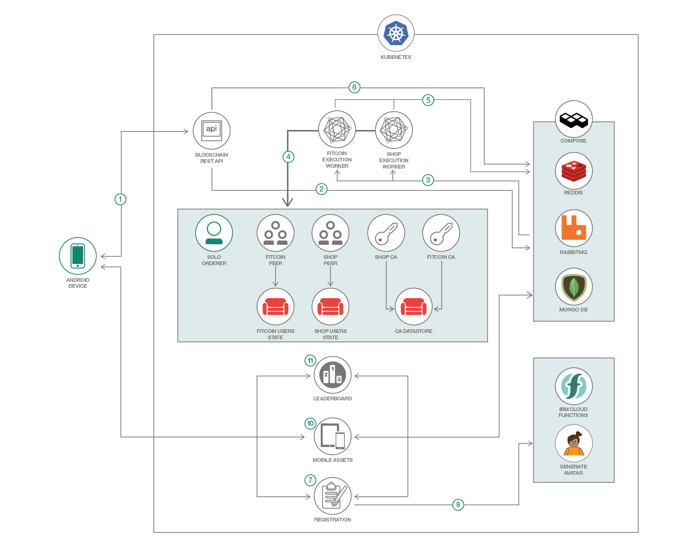

# android-kubernetes-blockchain

## Flow

1. The REST API is how the mobile app will interact with the blockchain network. The API will acknowledge the request and the mobile app will receive a unique key (random numbers and letters) which will be used to get the blockchain’s response later.
2. The API just stores the request in a queue in RabbitMQ. The queue has 2 channels, which are for the user (Fitcoin org) and the seller (Shop org). The requests can either be:
    * User enrollment
    * Query data from the blockchain network (number of kubecoins of a user, products that are for sale, contracts, etc…)
    * Invoke or perform a transaction (send steps to receive kubecoins, claim a product, complete a transaction, etc…)
3. The execution workers use the Hyperledger Fabric Node.js SDK to perform above requests. They are listening to the requests from RabbitMQ.
4. The workers send the requests to the Blockchain network and are then processed. The blockchain network uses NFS to persist the ledger and state database.
5. The workers receive the response and then persists it in the redis database with the unique key from (# 1).
6. The mobile app will continue to wait for the blockchain’s response results that should be in the redis database. This is where the unique key is used. The mobile app will query the redis database with the unique key.
7. The Registration microservice is used to create a user or update the user’s steps. When the blockchain network enrolls a user, this service uses the user id assigned by the blockchain network.
8. When a user is registered, it calls a Cloud Function to generate a random name and avatar for the user.
9. The data from the microservices are persisted in a MongoDB. This is where the user’s data (steps, name and avatar) and mobile assets (booklet/articles in the first view of mobile app) are persisted.
10. The mobile assets microservice is used to query the MongoDB to get dynamic data for the mobile app. The booklet in the first view uses the database for its content.
11. The leaderboard microservice is used to get the standings of the users.
